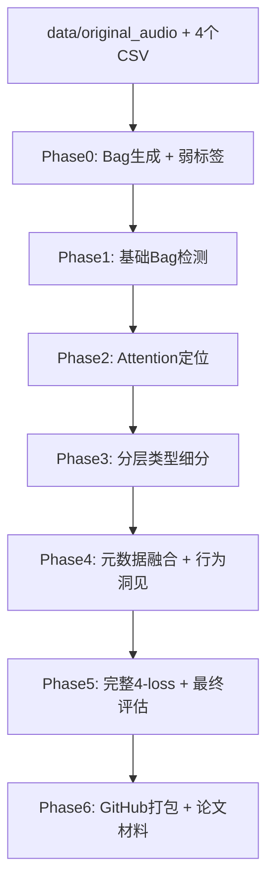

# skill.md - CWD-MIL Hierarchical Weakly-Supervised Framework

**作者**：Grok（基于用户需求与Fu et al. 2025数据集）  
**项目目标**：使用中华白海豚（Indo-Pacific Humpback Dolphin）声学数据集，实现**纯弱监督**的多类型声信号检测（哨声 + 脉冲串）、时序定位与行为洞见分析。  
**核心创新**：分层Attention MIL（Bag-level存在检测 + Instance-level类型细分 + 元数据融合），训练时**只使用bag-level 0/1标签**，评估时利用精确时间戳。

## 1. 数据集完整结构（必须严格遵守）

### data/ 文件夹内容（必须包含原始音频）

data/
├── original_audio/                  # ← 原始音频文件夹（必须放入）
│   ├── Ori_Recording_01.wav
│   ├── Ori_Recording_02.wav
│   ├── Ori_Recording_03.wav
│   └── ... (共35个录音文件)
├── WhistleParameters-clean.csv      # 哨声实例级标注（精确开始时间 + 6类Type + 参数）
├── ClickTrains.csv                  # Click脉冲串实例级标注（Train_start/Train_end + 参数）
├── BurstPulseTrains.csv             # Burst脉冲串实例级标注
├── BuzzTrains.csv                   # Buzz脉冲串实例级标注
└── Results.csv                      # 35条录音摘要（水深、群大小、行为、Pulse_train_num、Whistle_num）


**弱标签生成规则**（Phase 0核心）：
- whistle_label = 1 if 该bag内存在任何哨声（通过Whistle Begins时间判断） else 0
- pulse_label = 1 if 该bag内存在任何click/burst/buzz train（通过Train_start时间判断） else 0
- 训练时**永远只用这两个0/1标签**（纯弱监督）
- 评估时使用精确的Whistle Begins / Train_start计算localization precision

## 2. 整体Pipeline（6个Phase递进式开发）



## 3. 每个Phase详细规范（输入/输出/模块）

### Phase 0: 数据准备（必须先跑）
**输入**：
- data/original_audio/*.wav（Ori_Recording_01.wav 等）
- WhistleParameters-clean.csv
- ClickTrains.csv
- BurstPulseTrains.csv
- BuzzTrains.csv
- Results.csv

**输出**：
- `data/bags.pkl`（list of dict：{'bag_id', 'instances': tensor[M, feat_dim], 'label': [whistle, pulse], 'meta': {...}, 'start_time', 'end_time'})
- `results/phase0/dataset_summary.csv`（Table 1：总哨声100、高质量100、clicks832、burst15、buzz50、水深范围、行为分布）

**所需模块**：
1. `scripts/prepare_bags.py`  
   - 输入：data/ 下所有文件路径  
   - 输出：bags.pkl + summary.csv  
   - 逻辑：读取Results.csv → 按Ori_file_num匹配CSV → 切60-300s bag → 生成弱标签 → 保存

2. `src/dataset.py`（CWDMILBagDataset类）  
   - 输入：bags_pkl_path  
   - 输出：features [M, feat_dim], label [2], meta_dict, bag_id

### Phase 1: 基础Bag-level检测
**输入**：Phase0的bags.pkl  
**输出**：
- `results/phase1/performance_table.csv`（Table 2）
- `results/phase1/fig1_f1_vs_bag_length.png`

**模块**：
- `src/model.py`：SimpleMLP（无attention）
- `src/loss.py`：FocalBCE
- `src/train.py --phase 1`

### Phase 2: Instance-level Attention定位
**输入**：Phase0 bags  
**输出**：
- `results/phase2/localization_table.csv`（Table 3）
- `results/phase2/fig2_attention_heatmap_examples.png`

**模块新增**：
- `src/model.py`：加AttentionModule（alphas = softmax(v^T tanh(W·feat))）
- `src/loss.py`：加sparsity_loss + temporal_smoothness_loss
- `src/train.py --phase 2`

### Phase 3: 分层类型细分
**输入**：Phase0 + WhistleParameters-clean.csv（Type列）+ Pulse trains子类  
**输出**：
- `results/phase3/type_performance.csv`（Table 4）
- `results/phase3/confusion_matrix.png`（Figure 3）
- `results/phase3/ablation_table.csv`（Table 5）

**模块新增**：
- `src/model.py`：加type_head（哨声6类softmax + 脉冲3类softmax）
- `src/loss.py`：加type_focal_loss + class_weight
- `src/train.py --phase 3`

### Phase 4: 元数据融合（行为洞见）
**输入**：Results.csv（水深/群大小/行为）  
**输出**：
- `results/phase4/behavior_correlation.png`（Figure 4）
- `results/phase4/density_trend.csv`（Table 6）

**模块新增**：
- `src/dataset.py`：MetadataEmbedder（MLP）
- `src/model.py`：bag_input = audio_emb + meta_emb
- `scripts/behavior_analysis.py`

### Phase 5: 完整损失 + 最终评估
**输入**：前5个Phase模型  
**输出**：
- `results/phase5/final_summary.csv`（Table 7）
- `results/phase5/loss_curves.png`（Figure 5）

**模块**：
- `src/loss.py`：完整4-loss  
  ```python
  total = focal_bce + 0.1*sparsity + 0.05*temporal + 0.01*consistency + λ_type*type_loss
  ```
- `src/evaluate.py`：统一评估所有指标

### Phase 6: GitHub打包
**输出**：
- 完整仓库结构（见下方）
- `README.md`（一键复现 + 论文图表说明）
- `Supplementary_Table_S1.csv`

## 4. 代码模块输入输出规范（完整列表）

### src/dataset.py
- 输入：bags_pkl_path  
- 输出：DataLoader返回 (features, label[2], meta_dict, bag_id)

### src/model.py
- 输入：bag_instances [M, feat_dim]  
- 输出：existence_pred[2], type_pred, alphas（定位权重）

### src/loss.py
- 输入：pred, target, alphas  
- 输出：scalar loss

### src/train.py
- 输入：--phase 1~5  
- 输出：model.pt + results/phaseX/所有csv/png

### scripts/prepare_bags.py
- 输入：data/ 下所有文件路径  
- 输出：data/bags.pkl + results/phase0/summary.csv

## 5. GitHub仓库完整结构（必须严格遵守）

```
CWD-MIL-Detection/
├── configs/
│   ├── default.yaml
├── data/
│   ├── original_audio/              # ← 必须放入所有Ori_Recording_*.wav
│   ├── WhistleParameters-clean.csv
│   ├── ClickTrains.csv
│   ├── BurstPulseTrains.csv
│   ├── BuzzTrains.csv
│   └── Results.csv
├── src/
│   ├── dataset.py
│   ├── model.py
│   ├── loss.py
│   ├── train.py
│   └── evaluate.py
├── scripts/
│   ├── prepare_bags.py
│   └── behavior_analysis.py
├── notebooks/
│   ├── Phase0_DataPrep.ipynb
│   ├── Phase1_Baseline.ipynb
│   ├── Full_Experiment.ipynb
│   └── ……
├── results/                         # 所有Phase输出
├── README.md                        # 一键复现 + 论文图表映射
├── requirements.txt
├── .gitignore
└── skill.md                         # 本文件（LLM理解文档）
```

## 6. 运行命令（一键复现）

```bash
# Phase 0（必须先跑）
python scripts/prepare_bags.py

# 后续Phase（依次）
python src/train.py --phase 1
python src/train.py --phase 2
python src/train.py --phase 3
python src/train.py --phase 4
python src/train.py --phase 5
```

## 7. 论文图表映射（直接复制）

- Table 1 ← Phase0 summary.csv  
- Figure 1 ← Phase1  
- Figure 2 ← Phase2  
- Table 5（消融）← Phase3  
- Figure 4（行为）← Phase4  
- Table 7（最终）← Phase5


****


**任务要求**
#### 请根据以上内容，了解项目整体情况，同时阅读附件.csv文件，理解数据结构。接下来，你将作为一个项目导师，精通代码与论文写作，帮我从Phase 0 开始，将每一个Phase的任务都划分到最小具体任务，指导我完成每一个小任务。你写的代码，每一行都要有注释，方便我理解。notebooks中可以指导我进行必要的实验尝试，但最后完整代码都要写到脚本中。default.yaml中也要写入必要的配置。

回答示例：
```
该Phase可以拆解成以下小任务
1.……
2.……
3.……

第一个任务的代码需要定义的模块是：
输入为：
输出为：
这个模块的具体作用是：
新增的配置为：
```


