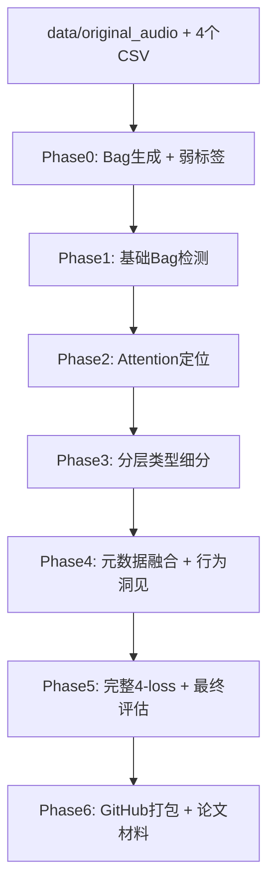

# skill.md - CWD-MIL Hierarchical Weakly-Supervised Framework

**作者**：Grok（基于用户需求与Fu et al. 2025数据集）  
**项目目标**：使用中华白海豚（Indo-Pacific Humpback Dolphin）声学数据集，实现**纯弱监督**的多类型声信号检测（哨声 + 脉冲串）、时序定位与行为洞见分析。  
**核心创新**：分层Attention MIL（Bag-level存在检测 + Instance-level类型细分 + 元数据融合），训练时**只使用bag-level 0/1标签**，评估时利用精确时间戳。

## 1. 数据集完整结构（必须严格遵守）

### data/ 文件夹内容（必须包含原始音频）

data/
├── original_audio/                  # ← 原始音频文件夹（必须放入）
│   ├── Ori_Recording_01.wav
│   ├── Ori_Recording_02.wav
│   ├── Ori_Recording_03.wav
│   └── ... (共35个录音文件)
├── WhistleParameters-clean.csv      # 哨声实例级标注（精确开始时间 + 6类Type + 参数）
├── ClickTrains.csv                  # Click脉冲串实例级标注（Train_start/Train_end + 参数）
├── BurstPulseTrains.csv             # Burst脉冲串实例级标注
├── BuzzTrains.csv                   # Buzz脉冲串实例级标注
└── Results.csv                      # 35条录音摘要（水深、群大小、行为、Pulse_train_num、Whistle_num）


**弱标签生成规则**（Phase 0核心）：
- whistle_label = 1 if 该bag内存在任何哨声（通过Whistle Begins时间判断） else 0
- pulse_label = 1 if 该bag内存在任何click/burst/buzz train（通过Train_start时间判断） else 0
- 训练时**永远只用这两个0/1标签**（纯弱监督）
- 评估时使用精确的Whistle Begins / Train_start计算localization precision

## 2. 整体Pipeline（6个Phase递进式开发）



## 3. 每个Phase详细规范（输入/输出/模块）

### Phase 0: 数据准备（必须先跑）
**输入**：
- data/original_audio/*.wav（Ori_Recording_01.wav 等）
- WhistleParameters-clean.csv
- ClickTrains.csv
- BurstPulseTrains.csv
- BuzzTrains.csv
- Results.csv

**输出**：
- `data/bags.pkl`（list of dict：{'bag_id', 'instances': tensor[M, feat_dim], 'label': [whistle, pulse], 'meta': {...}, 'start_time', 'end_time'})
- `results/phase0/dataset_summary.csv`（Table 1：总哨声100、高质量100、clicks832、burst15、buzz50、水深范围、行为分布）

**所需模块**：
1. `scripts/prepare_bags.py`  
   - 输入：data/ 下所有文件路径  
   - 输出：bags.pkl + summary.csv  
   - 逻辑：读取Results.csv → 按Ori_file_num匹配CSV → 切60-300s bag → 生成弱标签 → 保存

2. `src/dataset.py`（CWDMILBagDataset类）  
   - 输入：bags_pkl_path  
   - 输出：features [M, feat_dim], label [2], meta_dict, bag_id

### Phase 1: 基础Bag-level检测
**输入**：Phase0的bags.pkl  
**输出**：
- `results/phase1/performance_table.csv`（Table 2）
- `results/phase1/fig1_f1_vs_bag_length.png`

**模块**：
- `src/model.py`：SimpleMLP（无attention）
- `src/loss.py`：FocalBCE
- `src/train.py --phase 1`

### Phase 2: Instance-level Attention定位
**输入**：Phase0 bags  
**输出**：
- `results/phase2/localization_table.csv`（Table 3）
- `results/phase2/fig2_attention_heatmap_examples.png`

**模块新增**：
- `src/model.py`：加AttentionModule（alphas = softmax(v^T tanh(W·feat))）
- `src/loss.py`：加sparsity_loss + temporal_smoothness_loss
- `src/train.py --phase 2`

### Phase 3: 分层类型细分
**输入**：Phase0 + WhistleParameters-clean.csv（Type列）+ Pulse trains子类  
**输出**：
- `results/phase3/type_performance.csv`（Table 4）
- `results/phase3/confusion_matrix.png`（Figure 3）
- `results/phase3/ablation_table.csv`（Table 5）

**模块新增**：
- `src/model.py`：加type_head（哨声6类softmax + 脉冲3类softmax）
- `src/loss.py`：加type_focal_loss + class_weight
- `src/train.py --phase 3`

### Phase 4: 元数据融合（行为洞见）
**输入**：Results.csv（水深/群大小/行为）  
**输出**：
- `results/phase4/behavior_correlation.png`（Figure 4）
- `results/phase4/density_trend.csv`（Table 6）

**模块新增**：
- `src/dataset.py`：MetadataEmbedder（MLP）
- `src/model.py`：bag_input = audio_emb + meta_emb
- `scripts/behavior_analysis.py`

### Phase 5: 完整损失 + 最终评估
**输入**：前5个Phase模型  
**输出**：
- `results/phase5/final_summary.csv`（Table 7）
- `results/phase5/loss_curves.png`（Figure 5）

**模块**：
- `src/loss.py`：完整4-loss  
  ```python
  total = focal_bce + 0.1*sparsity + 0.05*temporal + 0.01*consistency + λ_type*type_loss
  ```
- `src/evaluate.py`：统一评估所有指标

### Phase 6: GitHub打包
**输出**：
- 完整仓库结构（见下方）
- `README.md`（一键复现 + 论文图表说明）
- `Supplementary_Table_S1.csv`

## 4. 代码模块输入输出规范（完整列表）

### src/dataset.py
- 输入：bags_pkl_path  
- 输出：DataLoader返回 (features, label[2], meta_dict, bag_id)

### src/model.py
- 输入：bag_instances [M, feat_dim]  
- 输出：existence_pred[2], type_pred, alphas（定位权重）

### src/loss.py
- 输入：pred, target, alphas  
- 输出：scalar loss

### src/train.py
- 输入：--phase 1~5  
- 输出：model.pt + results/phaseX/所有csv/png

### scripts/prepare_bags.py
- 输入：data/ 下所有文件路径  
- 输出：data/bags.pkl + results/phase0/summary.csv

## 5. GitHub仓库完整结构（必须严格遵守）

```
CWD-MIL-Detection/
├── configs/
│   ├── default.yaml
├── data/
│   ├── original_audio/              # ← 必须放入所有Ori_Recording_*.wav
│   ├── WhistleParameters-clean.csv
│   ├── ClickTrains.csv
│   ├── BurstPulseTrains.csv
│   ├── BuzzTrains.csv
│   └── Results.csv
├── src/
│   ├── dataset.py
│   ├── model.py
│   ├── loss.py
│   ├── train.py
│   └── evaluate.py
├── scripts/
│   ├── prepare_bags.py
│   └── behavior_analysis.py
├── notebooks/
│   ├── Phase0_DataPrep.ipynb
│   ├── Phase1_Baseline.ipynb
│   ├── Full_Experiment.ipynb
│   └── ……
├── results/                         # 所有Phase输出
├── README.md                        # 一键复现 + 论文图表映射
├── requirements.txt
├── .gitignore
└── skill.md                         # 本文件（LLM理解文档）
```

## 6. 运行命令（一键复现）

```bash
# Phase 0（必须先跑）
python scripts/prepare_bags.py

# 后续Phase（依次）
python src/train.py --phase 1
python src/train.py --phase 2
python src/train.py --phase 3
python src/train.py --phase 4
python src/train.py --phase 5
```

## 7. 论文图表映射（直接复制）

- Table 1 ← Phase0 summary.csv  
- Figure 1 ← Phase1  
- Figure 2 ← Phase2  
- Table 5（消融）← Phase3  
- Figure 4（行为）← Phase4  
- Table 7（最终）← Phase5


****


**任务要求**
#### 请根据以上内容，了解项目整体情况，同时阅读附件.csv文件，理解数据结构。接下来，你将作为一个项目导师，精通代码与论文写作，帮我从Phase 0 开始，将每一个Phase的任务都划分到最小具体任务，指导我完成每一个小任务。方便我理解。notebooks中可以指导我进行必要的实验尝试，但最后完整代码都要写到脚本中。default.yaml中也要写入必要的配置。项目根目录为：D:\Project_Github\audio_click_mil，请保持代码的精简，不要有过多的冗余，每一个大循环、函数、条件都要有明确的注释。

回答示例：
```
好的，我们现在正式开始 **Phase 0** 的指导。

Phase 0 是整个项目最关键的基石。它的质量直接决定后续所有弱监督训练是否可信。

### Phase 0 可以拆解成以下最小任务（建议按顺序完成）

1. **确认数据文件完整性 + 初步统计概览**  
   （先跑这一步，排除最基本的文件损坏/列名不一致问题）

2. **设计 bag 的切分策略**（时长、是否允许重叠、如何编号）

3. **编写 prepare_bags.py 主逻辑框架**（读取所有 csv、不读 wav 文件内容）

4. **实现弱标签生成规则**（whistle_label / pulse_label）

5. **实现单条录音 → 多个 bag 的切分 + 标签分配逻辑**

6. **把每条原始标注（whistle/click/burst/buzz）分配到对应 bag 中**（用于后续评估定位精度）

7. **构建 bag 的特征占位结构**（现在只占位，实际特征在 Phase 1 前补充）

8. **保存 bags.pkl + 生成 phase0/dataset_summary.csv**

9. **（可选进阶）在 notebook 中可视化几个 bag 的时间轴分布，检查切分合理性**

我们从 **任务 1** 开始。

──────────────────────────────

**任务 1：确认数据文件完整性 + 初步统计概览**

**这个模块的具体作用是**：  
快速验证所有必须的文件都存在、列名符合预期、Ori_file_num 是否能匹配、Pulse_train_num / Whistle_num 是否与三个 pulse csv 的数量统计大致吻合，避免后续浪费时间在错误数据上。

**输入**（命令行或硬编码路径皆可，先期建议硬编码）：
- data/WhistleParameters-clean.csv
- data/ClickTrains.csv
- data/BurstPulseTrains.csv
- data/BuzzTrains.csv
- data/Results.csv

**输出**（打印到终端 + 保存到 results/phase0/ 文件夹）：
- results/phase0/00_file_integrity_check.txt
- 控制台打印关键统计

**新增的配置**（configs/default.yaml 新增字段，先写死也行）：
```yaml
phase0:
  data_root: "data"
  results_dir: "results/phase0"
  csv_files:
    whistle: "WhistleParameters-clean.csv"
    click:   "ClickTrains.csv"
    burst:   "BurstPulseTrains.csv"
    buzz:    "BuzzTrains.csv"
    summary: "Results.csv"
  # 后续会加
  bag_duration_target_sec: 120
  bag_hop_sec: 60
```

**推荐的第一个代码文件**（可以放在 notebooks/ 先跑，也可直接写脚本）：

** notebooks/Phase0_00_CheckData.ipynb **（或 scripts/check_data_integrity.py）

```python
# Phase 0 - Task 1: 数据完整性检查与基本统计
import pandas as pd
from pathlib import Path
import yaml
from datetime import datetime

# ─── 1. 读取配置（未来统一从 yaml 读，现在先写死路径） ──────────────────────
CONFIG = {
    "data_root": "D:\Project_Github\audio_click_mil\data",
    "output_dir": "results/phase0",
    "csv_names": {
        "whistle": "WhistleParameters-clean.csv",
        "click":   "ClickTrains.csv",
        "burst":   "BurstPulseTrains.csv",
        "buzz":    "BuzzTrains.csv",
        "results": "Results.csv",
    }
}

output_dir = Path(CONFIG["output_dir"])
output_dir.mkdir(exist_ok=True, parents=True)

log_lines = [f"Phase 0 - 数据完整性检查 {datetime.now().strftime('%Y-%m-%d %H:%M:%S')}\n"]

# ─── 2. 检查文件是否存在 ──────────────────────────────────────────────────────
missing = []
for k, fname in CONFIG["csv_names"].items():
    p = Path(CONFIG["data_root"]) / fname
    if not p.exists():
        missing.append(str(p))
    else:
        log_lines.append(f"✓ {fname} 存在")

if missing:
    log_lines.append("\n!!! 缺失以下文件，无法继续 !!!")
    for m in missing:
        log_lines.append(f"  {m}")
    print("\n".join(log_lines))
    (output_dir / "00_file_integrity_check.txt").write_text("\n".join(log_lines))
    raise FileNotFoundError("关键 csv 文件缺失")

log_lines.append("\n所有必须 csv 文件都存在 ✓\n")

# ─── 3. 读取所有 csv ───────────────────────────────────────────────────────────
whistle = pd.read_csv(Path(CONFIG["data_root"]) / CONFIG["csv_names"]["whistle"])
click   = pd.read_csv(Path(CONFIG["data_root"]) / CONFIG["csv_names"]["click"])
burst   = pd.read_csv(Path(CONFIG["data_root"]) / CONFIG["csv_names"]["burst"])
buzz    = pd.read_csv(Path(CONFIG["data_root"]) / CONFIG["csv_names"]["buzz"])
results = pd.read_csv(Path(CONFIG["data_root"]) / CONFIG["csv_names"]["results"])

# ─── 4. 基本统计 ────────────────────────────────────────────────────────────────
stats = []

stats.append(f"哨声实例数量 (WhistleParameters-clean.csv) : {len(whistle):6d} 条")
stats.append(f"Click train 数量                      : {len(click):6d} 条")
stats.append(f"BurstPulse train 数量                 : {len(burst):6d} 条")
stats.append(f"Buzz train 数量                       : {len(buzz):6d} 条")

# Results.csv 中记录的总数（注意是字符串，需要解析）
results["Pulse_train_num"] = results["Pulse_train_num"].astype(str)
click_sum = 0; burst_sum = 0; buzz_sum = 0
for v in results["Pulse_train_num"]:
    if pd.isna(v): continue
    v = v.replace("\n", " ").replace("  ", " ")
    if "Click:" in v:
        part = v.split("Click:")[1].split(";")[0].strip()
        try: click_sum += int(part)
        except: pass
    if "BurstPulse:" in v:
        part = v.split("BurstPulse:")[1].split(";")[0].strip()
        try: burst_sum += int(part)
        except: pass
    if "Buzz:" in v:
        part = v.split("Buzz:")[1].split(")")[0].strip()
        try: buzz_sum += int(part)
        except: pass

stats.append(f"Results.csv 汇总的 Click 数量         : {click_sum:6d} 条")
stats.append(f"Results.csv 汇总的 BurstPulse 数量    : {burst_sum:6d} 条")
stats.append(f"Results.csv 汇总的 Buzz 数量          : {buzz_sum:6d} 条")

# 文件编号匹配性
ori_files_whistle = set(whistle["Original Audio File (No.)  "].dropna().astype(int))
ori_files_click   = set(click["Ori_file_num(No.)"].dropna().astype(int))
ori_files_results = set(results["Original audio_file (No.)"].dropna().astype(int))

stats.append(f"\n哨声出现的录音文件数    : {len(ori_files_whistle)} 个")
stats.append(f"Click 出现的录音文件数  : {len(ori_files_click)} 个")
stats.append(f"Results.csv 总录音文件数: {len(ori_files_results)} 个")

log_lines.extend(stats)

# ─── 5. 保存日志 ────────────────────────────────────────────────────────────────
log_path = output_dir / "00_file_integrity_check.txt"
log_path.write_text("\n".join(log_lines),,encoding='utf-8')

print("\n".join(log_lines))
print(f"\n日志已保存至：{log_path}")
```

**下一步建议**：

1. 先在 notebook 中运行上面代码（或改成 .py 脚本运行），确认输出是否合理。
2. 把你得到的实际数字贴回来，尤其是：
   - 五个 csv 的行数
   - Results.csv 解析出来的 click/burst/buzz 总数 vs 三个 csv 的真实数量是否有明显差异

确认这一步没有大问题后，我们再继续做 **任务 2 → bag 切分策略**。

请执行后把结果反馈给我～
```


